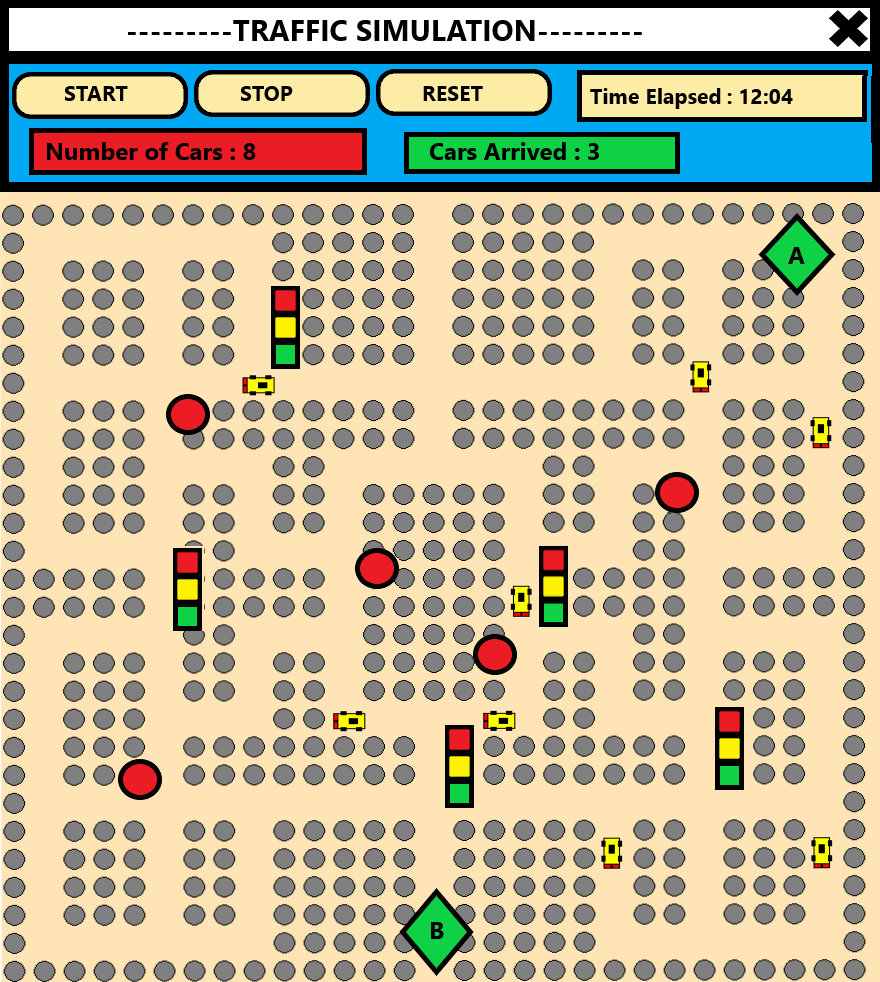

# CSCE 361 - City Traffic Simulator
* Team members:
    - Huy Vuong
    - Mohammad Majid
    - Bryan Chavéz
    - Brian Nguyen

* Supervisor:
    - Christopher Bohn (professor)
    - Brian Chong (TA)
    - Patt Mann the Mayor

* Git collaborating:
    - DO NOT work and commit in the master branch, master should always works and only contains functional items.
    - For each time you want to make changes or contribute anything, create a new branch and submit your commits in there. I will try to review all the changes daily and I see your changes can be a good fit, I will merge it into master.
    - Creating a new branch can be execute as follows:
```
git branch new_branch                 # create a new branch
git checkout new_branch               # switch to new branch
git fetch 
```
* To push a new branch:
```
git push -u origin new_branch
```
* To merge a branch :
```
git checkout master
git merge branch_to_merge
git branch -d branch_to_merge
```
## Milestone
### Increment 1 : Analysis 
* An initial version of RAD is attached in Requirements directory.

### Increment 2 : Object oriented Analysis and UML
* An initial version of Class and sequence digram.
* Tools : [draw.io](draw.io).
	- Display  : (\*.png).
	- Editable : (\*.xml).
* Target platform : Web Application / Application.
* Implementation language : Python, Django (maybe), HTML, XML, UML.

### Increment 3 : Design
* An initial version of Software Design Document is in the **Design** directory.
* Main frame prototype is added. Prototype right now is stored in **src** directory.
    - If the user has all the requirements python modules, just simply double click **Simulation.py** (main method).
    - If the user unable to execute **Simulation.py** by double-clicking, just navigate to the **src** and execute
        - ```source ./run.sh```

### Increment 4 : Object Design Development and Coding
* Program is stored in the src, structure are designed based solely on Object Oriented Paradigm
* A small testing framework, is set up for testing along with designing\
* New modules added : ```pytest```
* Features to develop:
    - Moving car and path finding
    - Interactive user interface.


## Traffic presentation

